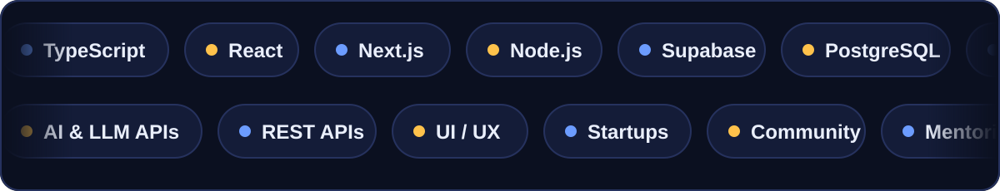
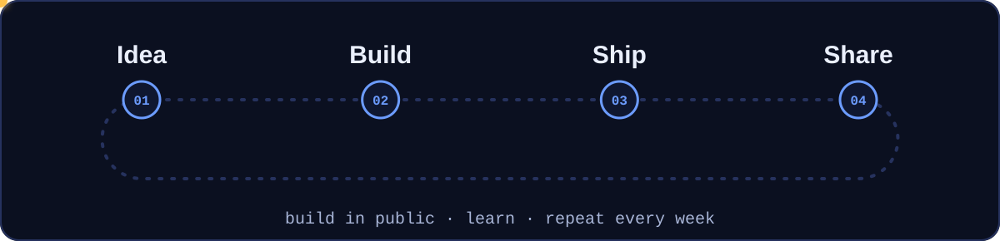

 

 

## 👋 Hi, I'm Aminul

I'm the co-founder and CEO of **Todvob AI** and General Secretary of the **Startup Association of Bangladesh**.
I like building AI-powered web products, and I help student developers turn their skills into **visible proof**:
a sharp GitHub, a clear LinkedIn, a one-page resume, and projects people can actually open and try.

 

## 🧰 Toolbox

 

## 🔁 How I build

 

## 🎯 What I'm focused on right now

- 🚀 Building **Todvob AI** and shipping useful products in public
- 🎓 Running practical sessions for students on **GitHub, LinkedIn, resumes, hackathons and startups**
- 🤝 Growing the startup and developer community in Bangladesh

 

## 🐍 My contribution snake

<picture>
  <source media="(prefers-color-scheme: dark)" srcset="https://raw.githubusercontent.com/aminultodvob/aminultodvob/output/github-snake-dark.svg" />
  <source media="(prefers-color-scheme: light)" srcset="https://raw.githubusercontent.com/aminultodvob/aminultodvob/output/github-snake.svg" />
  
</picture>

 

## 🤝 Let's connect

<!--
  Add your own links here, then remove the comment markers.
  Example badges (replace YOUR-HANDLE):

  
  
-->

Open an issue, say hi in a discussion, or send me a message. I'm always happy to talk about **AI, web development and startups**.

 

